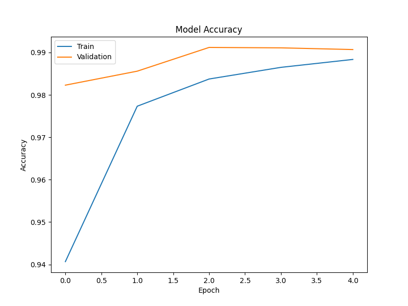
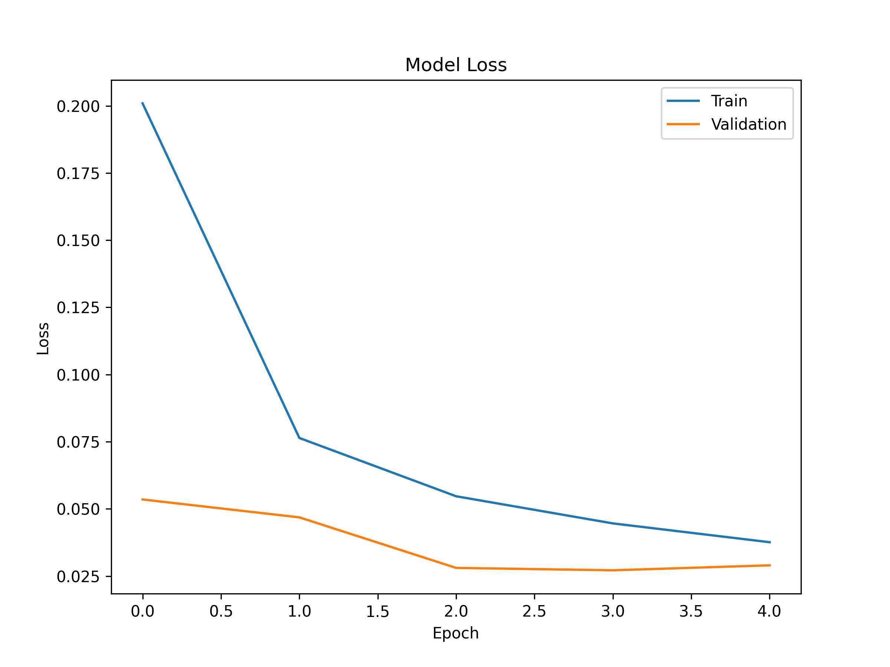
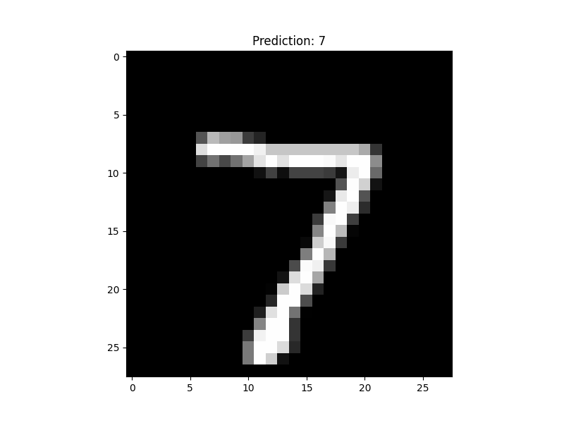

# MNIST CNN Digit Classifier

## Project Overview

This project implements a **Convolutional Neural Network (CNN)** using **TensorFlow/Keras** to classify handwritten digits from the **MNIST dataset**.
The model learns visual patterns such as edges, curves, and shapes in digit images to correctly identify numbers from **0–9**.

This project demonstrates the complete **deep learning workflow**:

* Loading and preprocessing image data
* Building a CNN architecture
* Training and validating the model
* Evaluating performance
* Visualizing training results

---

## Dataset

The **MNIST dataset** is a standard benchmark dataset used for image classification tasks in machine learning.

Dataset details:

* **60,000 training images**
* **10,000 testing images**
* Image size: **28 × 28 pixels**
* Grayscale images
* Labels: **Digits 0–9**


---

## Model Architecture

The CNN model consists of the following layers:

Conv2D (32 filters, 3×3 kernel)
ReLU Activation
MaxPooling (2×2)

Conv2D (64 filters, 3×3 kernel)
ReLU Activation
MaxPooling (2×2)

Flatten Layer

Dense Layer (64 neurons)
Dropout (0.3)

Output Layer (10 neurons, Softmax)

This architecture allows the network to extract hierarchical image features and perform multi-class classification.

---

## Training

The model was trained using:

* **Optimizer:** Adam
* **Loss Function:** Sparse Categorical Crossentropy
* **Evaluation Metric:** Accuracy
* **Epochs:** 5

Training accuracy reached approximately **97–98%**.

---

## Training Accuracy



---

## Training Loss



---

## Sample Predictions

The model successfully predicts handwritten digits from the test dataset.




---

## Technologies Used

* Python
* TensorFlow
* Keras
* NumPy
* Matplotlib
* Jupyter Notebook

---

## Project Structure
```
mnist-cnn
│
├── mnist.ipynb
├── requirements.txt
├── README.md
└── images
    ├── dataset_sample.png
    ├── training_accuracy.png
    ├── training_loss.png
    └── sample_predictions.png
```
---

## Installation

Clone the repository:

git clone https://github.com/your-username/mnist-cnn-digit-classifier.git

Navigate to the project directory:

cd mnist-cnn-digit-classifier

Install dependencies:

pip install -r requirements.txt

---


## License

This project is open-source and available under the MIT License.
